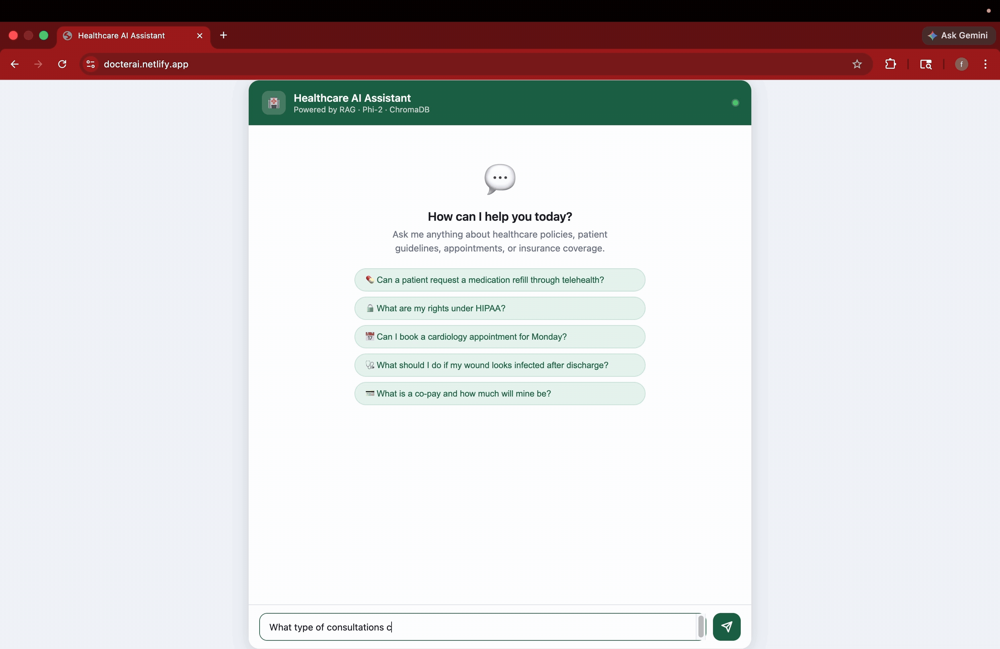

# Healthcare AI Assistant

A RAG-based AI assistant that answers healthcare questions from a curated document knowledge base, with an agentic appointment-routing workflow and query rewriting.

[](https://deepwiki.com/MoSahil147/Healthcare-AI-Assistant-using-RAG-LLMs)

## Live Demo

| | URL |
|---|---|
| Frontend (Netlify) | https://docterai.netlify.app |
| Backend API (Render) | https://healthcare-ai-assistant-using-rag-llms.onrender.com |
| API Docs (Swagger) | https://healthcare-ai-assistant-using-rag-llms.onrender.com/docs |

> The project is currently being run on local development. The links above are still live, but the backend deployment on Render is on hold for now due to out-of-memory issues on the free tier, all future updates will be pushed to these same links, so once redeployed you will be able to enjoy the web version straight from here. Until then, run it locally and enjoy!



## Architecture

```
User Question
     │
     ▼
┌──────────────────────────────────────┐
│   Query Rewriting (agent.py / rag.py) │  uses conversation history to clarify vague follow-ups
└──────────────────┬───────────────────┘
                   │
                   ▼
        Appointment keywords?
        (book / slot / cardiology / etc.)
                   │
         YES ──────┤──────── NO
                   │               │
                   ▼               ▼
        check_available_slots()   RAG Pipeline (rag.py)
        mock slot response        │
                                  ├─ Embed question (HF Inference API)
                                  ├─ Query ChromaDB (top-4 chunks, cosine similarity)
                                  ├─ Build prompt (context + question)
                                  ├─ Call Groq LLM (llama-3.3-70b-versatile)
                                  └─ Answer + Source Citations + Confidence
```

## Project Structure

```
Healthcare-AI-Assistant-using-RAG-LLMs/
├── app/
│   ├── config.py      # constants, env validation, lazy model singletons
│   ├── embeddings.py  # document ingestion, ChromaDB singleton, similarity search
│   ├── rag.py         # per-session history, query rewriting, RAG answer pipeline
│   ├── llm.py         # prompt template, Groq call with tenacity retry + fallback
│   ├── agent.py       # keyword router, appointment slot tool
│   └── main.py        # FastAPI app, rate limiting, request/response models
├── data/
│   ├── telehealth_guidelines.txt
│   ├── medication_refill_policy.txt
│   ├── hipaa_privacy_guidelines.txt
│   ├── discharge_instructions.txt
│   ├── appointment_scheduling_policy.txt
│   └── insurance_eligibility_faq.txt
├── static/
│   └── index.html     # chat UI (served at /)
├── store/             # ChromaDB persistence (gitignored)
├── tests/
│   └── test_api.py    # 21 tests covering endpoints, routing logic, RAG helpers
├── .env               # HF_TOKEN and GROQ_API_KEY (never committed)
├── .env.example
├── requirements.txt
├── pyproject.toml
├── uv.lock
├── Dockerfile
└── docker-compose.yml
```

## Tech Stack

| Component        | Choice                                    | Why                                                              |
|-----------------|-------------------------------------------|------------------------------------------------------------------|
| LLM             | `llama-3.3-70b-versatile` via Groq API    | Fast inference, strong instruction-following, free tier available |
| LLM Fallback    | `llama-3.1-8b-instant` via Groq API       | Auto-used if primary model hits rate limits                      |
| Embeddings      | `all-MiniLM-L6-v2` via HuggingFace API   | 384-dim, fast, excellent English semantic similarity             |
| Vector DB       | ChromaDB (persistent, cosine similarity)  | File-based, no external service needed, easy Docker volume       |
| RAG Framework   | LangChain                                 | Clean abstractions for loading, chunking, and retrieval          |
| API Framework   | FastAPI                                   | Fast, typed, auto-docs at `/docs`                                |
| Rate Limiting   | slowapi                                   | IP-based rate limiting on `/ask` to protect Groq quota           |
| Retry           | tenacity                                  | Exponential backoff on transient LLM errors before returning 500 |
| Package Manager | uv                                        | 10-100x faster than pip, lockfile via uv.lock                    |

## Dataset

The knowledge base consists of **6 synthetic healthcare documents** written for this prototype, aligned with **Indian medical laws and regulations (2026)**. Stored in the `/data` folder:

| File | Content | Key Regulations |
|---|---|---|
| `telehealth_guidelines.txt` | Eligibility, video visit requirements, medication refills via telehealth | Telemedicine Practice Guidelines 2020, NMC, NDPS Act 1985 |
| `medication_refill_policy.txt` | Refill process, controlled substance rules, pharmacy coordination | Drugs & Cosmetics Act 1940, Schedule H/H1, CDSCO |
| `hipaa_privacy_guidelines.txt` | Patient data rights, breach notification, ABHA health IDs | DPDPA 2023, IT Act 2000, ABDM |
| `discharge_instructions.txt` | Post-surgery care, warning signs, wound care, follow-up scheduling | Clinical Establishments Act 2010, NABH, ICMR |
| `appointment_scheduling_policy.txt` | Booking channels, departments, wait times, cancellation policy | PMJAY, ABDM/ABHA, NABH |
| `insurance_eligibility_faq.txt` | Coverage verification, co-pay, prior authorisation, cashless claims | IRDAI, PMJAY (₹5 lakh cover), CGHS, ECHS |

**No real patient data or PHI is used.** All documents are original synthetic content.

## Prerequisites

Create a `.env` file (see `.env.example`):

```
HF_TOKEN=your_huggingface_token_here
GROQ_API_KEY=your_groq_api_key_here
```

Get your free tokens:
- HuggingFace token: https://huggingface.co/settings/tokens
- Groq API key: https://console.groq.com

## Local Setup

```bash
# 1. Create the virtual environment and install all pinned dependencies
uv venv && source .venv/bin/activate
uv sync

# 2. Add your API keys to .env
cp .env.example .env
# edit .env and fill in HF_TOKEN and GROQ_API_KEY

# 3. Start the server (documents auto-ingest on startup)
uv run uvicorn app.main:app --reload --port 8000
```

Open `http://localhost:8000` to use the chat UI.
API docs available at `http://localhost:8000/docs`.

## Docker Setup

```bash
docker compose build
docker compose up
```

Documents are auto-ingested on container start. API available at `http://localhost:8000`.

## API Endpoints

### `GET /health`
```bash
curl http://localhost:8000/health
# {"status":"ok","model":"llama-3.3-70b-versatile","fallback_model":"llama-3.1-8b-instant"}
```

### `POST /ingest`
Manually re-ingests all `.txt` files from `/data` into ChromaDB.
```bash
curl -X POST http://localhost:8000/ingest
# {"status":"ok","chunks_stored":54}
```

### `POST /ask`

Accepts an optional `session_id` to maintain conversation history across multiple requests.
If omitted, a UUID is generated automatically for that request.

```bash
# In-document question
curl -X POST http://localhost:8000/ask \
  -H "Content-Type: application/json" \
  -d '{"question": "Can a patient request a medication refill through telehealth?"}'

# Multi-turn conversation (pass the same session_id across requests)
curl -X POST http://localhost:8000/ask \
  -H "Content-Type: application/json" \
  -d '{"question": "Can a patient request a medication refill through telehealth?", "session_id": "user-123"}'

curl -X POST http://localhost:8000/ask \
  -H "Content-Type: application/json" \
  -d '{"question": "What about controlled substances?", "session_id": "user-123"}'

# Out-of-domain fallback test
curl -X POST http://localhost:8000/ask \
  -H "Content-Type: application/json" \
  -d '{"question": "What is the boiling point of water?"}'
# Returns: "I could not find this information in the provided documents."

# Appointment routing (agentic tool)
curl -X POST http://localhost:8000/ask \
  -H "Content-Type: application/json" \
  -d '{"question": "Can I book a cardiology appointment for Monday?"}'
```

Sample response:
```json
{
  "answer": "Yes, patients can request medication refills via telehealth under the Telemedicine Practice Guidelines 2020, provided the medication is non-Schedule H1 and the prescribing doctor reviews the case remotely.",
  "sources": [
    {
      "document": "telehealth_guidelines.txt",
      "chunk": "Medication refill requests may be reviewed during telehealth visits..."
    }
  ],
  "confidence": "high"
}
```

## Prompt Template

```
You are a healthcare assistant. Answer ONLY using the context provided below.
If the answer is not in the context, respond exactly with:
"I could not find this information in the provided documents."
Do not diagnose, prescribe, or give direct medical advice.
Keep your answer professional, accurate, and concise.

Context:
{context}

Question: {question}

Answer:
```

## Sample Questions & Responses

| Question | Expected Behaviour |
|---|---|
| Can a patient request a medication refill through telehealth? | RAG → yes, with conditions from `telehealth_guidelines.txt` |
| What are my rights under the DPDPA 2023? | RAG → patient data rights from `hipaa_privacy_guidelines.txt` |
| What should I do if my wound is infected after discharge? | RAG → warning signs from `discharge_instructions.txt` |
| How do I cancel an appointment? | RAG → 24-hour policy from `appointment_scheduling_policy.txt` |
| What is a co-pay under IRDAI? | RAG → explanation from `insurance_eligibility_faq.txt` |
| Can I book a cardiology appointment for Monday? | Agent → mock slot availability (tool call) |
| What is the capital of France? | Fallback → "I could not find this information in the provided documents." |
| What are the rules for NDPS Act prescriptions? | RAG → controlled substance rules from `medication_refill_policy.txt` |

## Agent Workflow

```
Question received
       │
       ▼
(1) Rewrite vague follow-ups using conversation history
       │
       ▼
Does the question contain appointment keywords?
("appointment", "book", "slot", "cardiology", "orthopaedics", etc.)
       │
      YES ──► extract department + date ──► check_available_slots() ──► mock slots response
       │
       NO ──► RAG pipeline:
              embed question → ChromaDB top-4 chunks
              → if distance > 0.8: return fallback (no hallucination)
              → else: build prompt → Groq LLM → answer + citations
```

The router uses keyword matching, no LLM call needed for routing decisions, keeping latency low.
Query rewriting uses the LLM to turn "what about that?" into a clear standalone question before searching.

## Running Tests

```bash
uv run pytest tests/ -v
```

## Limitations & Future Improvements

**Current limitations:**
- Keyword-based appointment routing can misroute ambiguous edge-case questions.
- No user authentication, all endpoints are public.
- Mock appointment slots are hardcoded; no real scheduling system connected.
- Per-session conversation history is in-memory and resets on server restart.

**With more time:**
- Replace keyword router with a small LLM classifier for intent detection.
- Add reranking (CrossEncoder) to improve retrieval precision.
- Implement streaming responses for faster perceived latency.
- Connect to a real appointment scheduling system via calendar API.
- Add JWT/OAuth2 authentication with role-based access.
- Persist session history to Redis so conversations survive server restarts.

## Healthcare Data Privacy Note

This application uses **entirely synthetic, non-PHI documents**. No real patient data, clinical records, or personally identifiable health information is stored or processed.

Documents are written in alignment with Indian healthcare regulations. For production deployment with real patient data in India, this system would require:

- Compliance with the **Digital Personal Data Protection Act (DPDPA) 2023**
- Compliance with the **IT Act 2000** and relevant CERT-In guidelines
- Integration with **ABDM/ABHA** for health ID management
- End-to-end encryption for data at rest and in transit
- Audit logging for all health data access
- Registration under the **Clinical Establishments Act 2010** where applicable
- Data localisation requirements per Indian data protection norms
